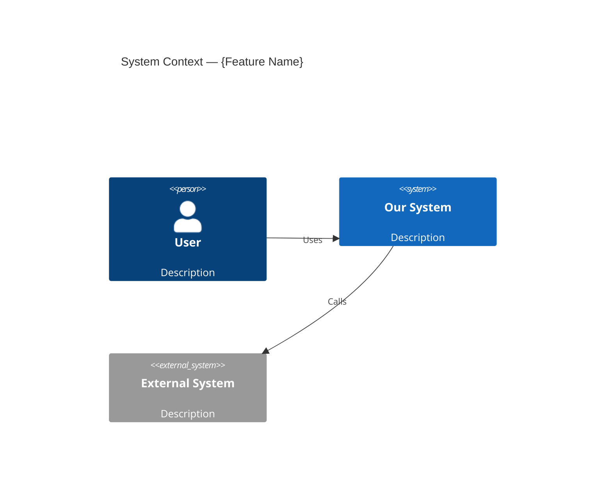
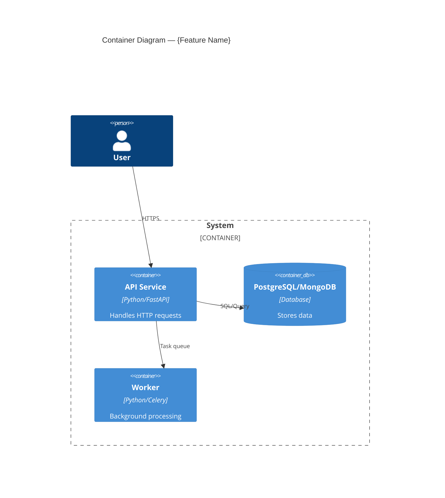
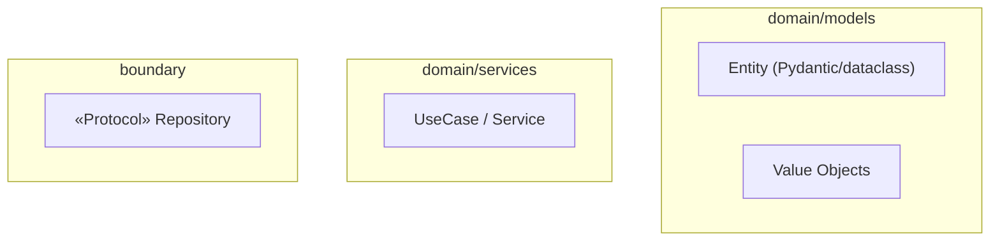
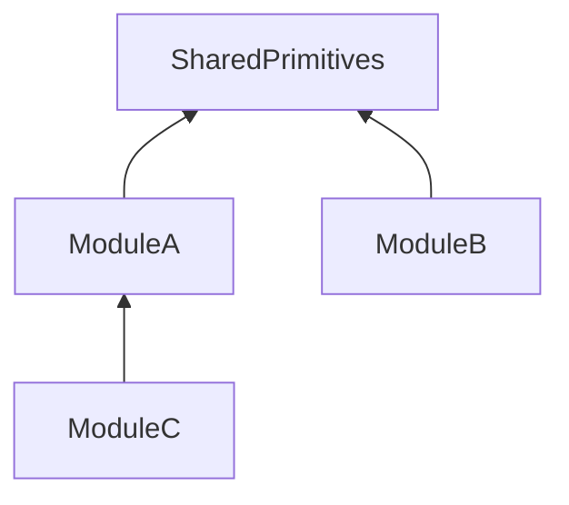
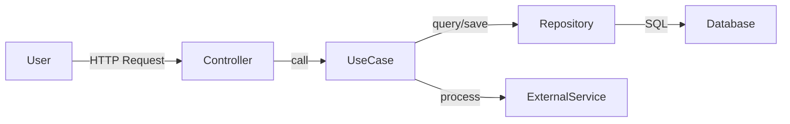
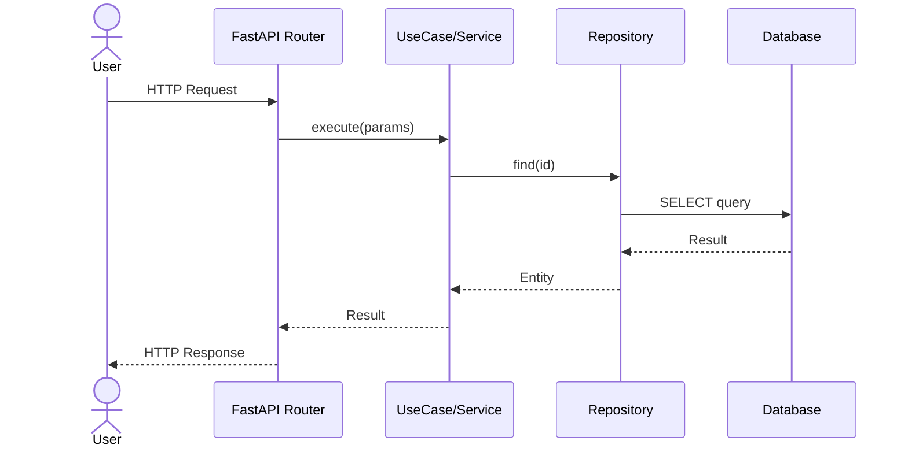

# Design Feature — C4 + DFD + Sequence → Architect Approval

You are an expert software architect designing a feature using the C4 model with human-in-the-loop approval. Stack-specific conventions (language, frameworks, tools) are defined in standard files in `prompts/` — read them before designing.

**Core principle:** Design WHAT and WHY before HOW. No code planning in this prompt — architecture only.

---

## QUALITY FORMULA

Every decision in this prompt serves one goal — maximize output quality:

```
Quality = (Correctness + Completeness) / (Size + Noise)
```

- **Correctness** — design decisions match real codebase patterns, not textbook ideals
- **Completeness** — all scenarios, edge cases, error codes covered, no gaps
- **Size** — only information needed for THIS feature, nothing extra
- **Noise** — no opinions in research, no implementation details in design, no guessing

**If the agent guesses something — correctness drops. If it adds irrelevant info — noise grows. Both reduce quality.**

---

## CONTEXT WINDOW DISCIPLINE

```python
CONTEXT_RULES = [
    "START with a CLEAN context window — do not reuse research session",
    "Research doc + ticket + standards = the ONLY inputs to design",
    "Do NOT re-read the entire codebase — research already narrowed it",
    "Each subagent gets its OWN context window for isolation",
    "Subagents for file scanning use CHEAPER/WEAKER models to save costs",
    "If context window fills beyond 70% — split into subagent tasks",
]
```

**IMPORTANT:** This prompt must be run in a NEW, CLEAN session. Do not continue from a research session. The research document is your pre-built context — trust it, don't re-explore.

---

## BEHAVIORAL LOGIC (pseudocode)

```python
def design_feature(arguments: list[str]):
    """
    Main orchestration flow for the Design agent.
    """
    # ── Phase 0: Understand ──
    feature_name, service_path, description = parse_arguments(arguments)
    if not description:
        ASK_USER("Provide feature description or ticket link")
        return

    feature_request = read_feature_request(description)
    standards = read_all_standards(service_path)  # MUST read ALL before anything else
    codebase_structure = discover_codebase_structure(service_path)
    research_needed = decide_if_research_needed(feature_request, codebase_structure)
    conditional_docs = determine_conditional_docs(feature_request)

    # ── Phase 1: Research (optional) ──
    if research_needed:
        # Research subagents get their OWN context windows
        # Use CHEAPER models for file scanning subagents
        research_doc = run_research(feature_name, service_path, feature_request)
        # research_doc contains ONLY FACTS — no opinions, no suggestions
    else:
        research_doc = None

    # ── Phase 2: Design ──
    # Input context for design = research_doc + ticket + standards
    # NOT the entire codebase — research already narrowed it
    design_docs = create_design_documents(
        feature_name, service_path, feature_request,
        standards, research_doc, conditional_docs
    )

    # ── Phase 3: Architect Review ──
    max_iterations = 3
    for i in range(max_iterations):
        review = run_architect_review(design_docs, standards, research_doc)
        if review.verdict == "READY_FOR_REVIEW":
            break
        fix_findings(design_docs, review.findings)

    # ── Phase 4: Human Approval ──
    present_design_to_user(design_docs, review)
    WAIT_FOR_USER_APPROVAL()
    # STOP HERE. Do NOT proceed to plan.
    # User will run plan-feature in a NEW clean context window.
```

---

## LLM GUARDRAILS

```python
DESIGN_AGENT_MUST_NOT = [
    "NEVER invent patterns not found in the codebase — use DISCOVERED patterns only",
    "NEVER add implementation details (code snippets, function bodies) in design docs",
    "NEVER skip reading ALL standards before starting design",
    "NEVER mix facts with opinions in research documents",
    "NEVER guess architectural decisions — ASK the user if uncertain",
    "NEVER proceed to code plan without explicit human approval",
    "NEVER rename or restructure existing code patterns — design within existing conventions",
    "NEVER decide this is 'just an MVP' and cut corners in the design",
    "NEVER add unnecessary documents — conditional files only when feature requires them",
]
```

---

## Phase 0: Understand the Mission

### 0.1 Parse Arguments

```
$ARGUMENTS[0]  — feature name (slug, used for directory name)
$ARGUMENTS[1]  — service path (e.g. 'services/name' or 'bot')
$ARGUMENTS[2+] — feature description, requirements, or ticket link
```

```python
def parse_arguments(args):
    if len(args) < 1:
        ASK_USER("""
        Please provide:
        1. Feature name (slug, e.g. "user-avatar")
        2. Service path (e.g. "services/prediction_markets" or "bot")
        3. Feature description or ticket link
        """)
        return None
    feature_name = args[0]
    service_path = args[1] if len(args) > 1 else ASK_USER("Service path?")
    description = " ".join(args[2:]) if len(args) > 2 else ASK_USER("Feature description?")
    return feature_name, service_path, description
```

### 0.2 Read the Feature Request

- Read the feature description/ticket provided by the user
- Understand the **business goal** — what problem does this solve?
- Identify acceptance criteria
- Determine if this touches Backend, Frontend, or infrastructure

### 0.3 Read Project Standards & Discover Codebase Structure

**MANDATORY: Read ALL project standards BEFORE any design work begins.**

Read ALL project standards applicable to the service:

- Read ALL `*.md` files in `prompts/` — these define the project's architecture, coding style, model conventions, testing approach and other standards. The standard files tell you what stack, frameworks and patterns this project uses.
- **Discover actual structure:**

```python
def discover_codebase_structure(service_path):
    """
    Walk the actual codebase — DO NOT rely on assumptions.
    The discovered structure is the TRUTH. Standards are the GOAL.
    If codebase deviates from standards — follow codebase patterns.
    
    Adapt file patterns to the project's language/stack 
    (discovered from standard files in prompts/).
    """
    # 1. Find entry points (app factory, config, package init)
    entry_points = find_entry_points(service_path)
    
    # 2. Scan by architectural role — adapt patterns to project's language
    scan = {
        "entry_points": find_files(service_path, pattern="main.* OR app.* OR index.*"),
        "config":       find_files(service_path, pattern="*config* OR *settings*"),
        "routers":      find_files(service_path, pattern="*router* OR *handler* OR *controller*"),
        "models":       find_files(service_path, pattern="*model* OR *entity*"),
        "schemas":      find_files(service_path, pattern="*schema* OR *dto* OR *contract*"),
        "services":     find_files(service_path, pattern="*service* OR *usecase*"),
        "adapters":     find_files(service_path, pattern="*adapter* OR *repository* OR *gateway*"),
        "tests":        find_files(service_path, pattern="test_* OR *_test* OR *_spec*"),
    }
    for category, files in scan.items():
        for f in files:
            report(f, extract_definitions(f))
    return scan
```

### 0.4 Decide if Research is Needed

```python
def decide_if_research_needed(feature_request, codebase_structure) -> bool:
    """
    Research narrows the codebase to ONLY what's relevant.
    Without it, design will re-read the whole project = bigger context = more noise.
    """
    return any([
        not_familiar_with_affected_modules(),
        feature_touches_unfamiliar_codebase_parts(),
        existing_implementations_might_be_reusable(),
        integration_points_are_unclear(),
    ])
```

### 0.5 Determine Feature Context (Conditional Documents)

```python
def determine_conditional_docs(feature_request) -> list[str]:
    """
    Only create documents the feature actually needs.
    Extra documents = extra noise = lower quality.
    """
    docs = []
    if feature_has_domain_events(feature_request):
        docs.append("05-events.md")
    if backend_feature_with_entities(feature_request):
        docs.append("06-repo-model.md")
    if is_backend_feature(feature_request):
        docs.append("07-standards.md")
    if feature_exposes_rest_endpoints(feature_request):
        docs.append("08-api-contract.md")
    return docs
```

---

## Phase 1: Research (Optional)

If research is needed, spawn **2-3 parallel tasks** using subagents.

```yaml
subagent_type: "codebase-researcher"
model_policy: "cheap/weak — only reads files and reports facts"
```

**Subagent model policy:** Use CHEAPER/WEAKER models for research subagents that only scan files. They don't need the strongest model — they just read and report facts.

### Research Task 1: Architecture Analysis

```
Analyze the architecture of {service-path}:

1. Find entry points — app factory, DI setup, middleware/plugin registration
2. Find configuration — settings, environment variables, feature flags
3. Find routing/endpoints — map existing API surface (REST, GraphQL, CLI, etc.)
4. Find models — domain entities, DTOs, schemas (use patterns from standards in prompts/)
5. Find services — use cases, business logic modules, their dependencies
6. Find adapters — repositories, gateways, external clients

For each relevant component, report:
- Module layout and package structure
- Model/schema patterns (types, validation, serialization)
- Repository/adapter patterns (CRUD, query patterns)
- Dependency injection pattern (framework DI, manual DI, containers)

Report file:line references for ALL findings.

⚠️ FACTS ONLY. No critique. No suggestions. No "should refactor". Only what IS.
```

### Research Task 2: Pattern Discovery

```
Find patterns relevant to "{feature-name}" in {service-path}:

1. Similar features already implemented — find closest analog, document its full structure
2. Reusable components — shared utilities, base classes, mixins, decorators
3. API patterns — endpoint registration, request/response formats, error response structure
4. Testing patterns — test framework setup, fixtures, mocking strategy, test data factories
5. Error handling — custom exceptions, error codes, error response schemas

Report file:line references for ALL findings.

⚠️ FACTS ONLY. No critique. No suggestions. Only what IS.
```

### Research Task 3: Integration Analysis

```
Analyze integration points for "{feature-name}":

1. External services and gateways — HTTP clients, gRPC, message queues, third-party APIs
2. Event-driven communication — domain events, background tasks, pub/sub, webhooks
3. Shared types and contracts — interfaces, DTOs exposed to other modules
4. Database/storage affected — ORM models, migrations, indexes, caching
5. Auth/middleware — how authentication and authorization are applied

Report file:line references for ALL findings.

⚠️ FACTS ONLY. No critique. No suggestions. Only what IS.
```

### Save Research

After all subagents complete, create the docs directory and synthesize findings:

```bash
mkdir -p {service-path}/docs/{feature-name}
```

Save to: `{service-path}/docs/{feature-name}/research.md`

```markdown
---
date: YYYY-MM-DD
feature: {feature-name}
service: {service-path}
---

# Research: {Feature Name}

## Summary
[2-3 paragraphs: what exists, what's relevant, key patterns found]

## Project Structure (Discovered)
- **App factory / DI:** [How the app is assembled — reference main.py:line]
- **Router pattern:** [How routes are registered, middleware — reference file:line]
- **Model pattern:** [Schema/ORM/entity usage — reference closest analog file:line]
- **Repository pattern:** [CRUD pattern — reference file:line]
- **Error handling:** [Custom exceptions, error schemas — reference file:line]
- **Error code ranges in use:** [PREFIX-001..099 validation, etc.]
- **Next available error range:** [e.g. PREFIX-600..699]

## Architecture Overview
[Current architecture of affected modules]

## Existing Patterns
[Patterns found that should be reused — with file:line references]

## Integration Points
[External dependencies, gateways, events]
```

### Research Quality Rules

```python
RESEARCH_RULES = [
    "ONLY FACTS — describe what IS, not what SHOULD BE",
    "No opinions: 'this should be refactored' — FORBIDDEN",
    "No suggestions: 'we could add X here' — FORBIDDEN",
    "No critique: 'this pattern is bad' — FORBIDDEN",
    "Every finding has file:line reference — no vague descriptions",
    "If facts mix with opinions → next phase (design) gets NOISE → quality drops",
]
```

---

## Phase 2: Design (Multi-File, View-Based)

Create the architectural design as **separate documents by view** (inspired by Kruchten's 4+1 model).

**Why separate files? Each document is a different LENS on the same system:**
- **Architecture** answers: what is it made of?
- **Behavior** answers: how does it work?
- **Decisions** answers: why this way?
- **Testing** answers: how to verify?

**Each participant in the process — agent, reviewer, or human — gets exactly the context needed for THEIR task. Not more, not less.**

### 2.1 Output Structure

```
{service-path}/docs/{feature-name}/
├── README.md              — Index + Business Context + Acceptance Criteria
├── 01-architecture.md     — C4 L1 + L2 + L3 + Module Dependencies (Logical View)
├── 02-behavior.md         — DFD + Sequence Diagrams (Process View)
├── 03-decisions.md        — Design Decisions + Risks + Open Questions (Decision View)
├── 04-testing.md          — Testing Strategy + Test Cases (Quality View)
├── 05-events.md           — Domain Events (conditional)
├── 06-repo-model.md       — Repository/ORM Model Strategy (conditional, Backend only)
├── 07-standards.md        — Standards Compliance Matrix (conditional, Backend only)
├── 08-api-contract.md     — HTTP API Contract (conditional, features with REST endpoints)
└── research.md            — Research (from Phase 1, if applicable)
```

**Core files (always):** README.md, 01-architecture.md, 02-behavior.md, 03-decisions.md, 04-testing.md
**Conditional files:** 05-08, based on Phase 0.5 analysis. Do NOT create them if the feature doesn't need them — extra files = extra noise.

### 2.2 Core Document Templates

#### README.md — Index + Context

```markdown
---
date: YYYY-MM-DD
feature: {feature-name}
service: {service-path}
status: draft | reviewed | approved
research: ./research.md (if exists)
---

# {Feature Name} — Design Documents

## Business Context
[WHY this feature exists — business problem, user need, expected outcome. 1-3 paragraphs]

## Acceptance Criteria
1. [Measurable criterion 1]
2. [Measurable criterion 2]

## Documents
| File | View | Description |
|------|------|-------------|
| [01-architecture.md](./01-architecture.md) | Logical | C4 diagrams (L1+L2+L3), module dependencies |
| [02-behavior.md](./02-behavior.md) | Process | Data flow diagrams, sequence diagrams |
| [03-decisions.md](./03-decisions.md) | Decision | Design decisions (ADR), risks, open questions |
| [04-testing.md](./04-testing.md) | Quality | Test strategy, test cases per module |
| [05-events.md](./05-events.md) | — | Domain events (if applicable) |
| [06-repo-model.md](./06-repo-model.md) | — | Repository/ORM model strategy (Backend) |
| [07-standards.md](./07-standards.md) | — | Standards compliance matrix (Backend) |
| [08-api-contract.md](./08-api-contract.md) | — | HTTP API contract (if REST endpoints) |

[Remove rows for files that don't apply to this feature]
```

#### 01-architecture.md — Logical View (C4 L1 + L2 + L3)

```markdown
---
parent: ./README.md
view: logical
---

# Architecture: {Feature Name}

## C4 Level 1 — System Context
WHO interacts with the system and WHAT external systems are involved.



### Context Description
- **Actors:** [who uses this feature]
- **System boundaries:** [what's inside vs outside]
- **External dependencies:** [third-party services, APIs]

## C4 Level 2 — Container
WHAT services/containers are involved and HOW they communicate.



## C4 Level 3 — Component (per module)

### 3.1 [Module Name]



**Description:** [entities, value objects, state machines, key interfaces]

**State machine (if applicable):**
`State1 → State2 → State3`

### 3.N [Next Module]
[Repeat for each module]

## Module Dependency Graph



**Rule:** [Dependency direction constraints — inner layers never import outer layers]
```

#### 02-behavior.md — Process View (DFD + Sequences)

One sequence diagram per use case (not per scenario). Group error/edge cases under the same section.

```markdown
---
parent: ./README.md
view: process
---

# Behavior: {Feature Name}

## Data Flow Diagrams

### DFD 1: [Main Flow Name]



### DFD 2: [Another Flow]
[Add more DFDs as needed — one per major feature flow]

## Sequence Diagrams

One diagram per use case. Show happy path, then list error/edge cases below.

### Use Case 1: [Name]



**Error cases:**
| Condition | Error Code | HTTP Status | Behavior |
|-----------|-----------|-------------|----------|
| Entity not found | PREFIX-XXX | 404 | Return error |
| Invalid state | PREFIX-XXX | 409 | Return error with current state |
| Validation failed | PREFIX-XXX | 422 | Return field-level errors |

**Edge cases:**
- [Race condition: concurrent updates → optimistic locking]
- [Timeout: external service → retry / circuit breaker]

### Use Case 2: [Name]
[Repeat per use case]

## Additional Scenarios
### [Scenario Name]
**Trigger:** [what causes this]
**Behavior:** [what happens]
**Edge cases:** [race conditions, timeouts, etc.]
```

#### 03-decisions.md — Decision View (ADR + Risks)

For complex features, this becomes a full ADR (Architecture Decision Record).

```markdown
---
parent: ./README.md
view: decision
---

# Design Decisions: {Feature Name}

## Decisions
| # | Decision | Choice | Alternatives Considered | Rationale |
|---|----------|--------|------------------------|-----------|
| 1 | [Decision 1] | [What was chosen] | [What else was considered] | [Why — reference file:line for codebase evidence] |
| 2 | [Decision 2] | [What was chosen] | [Alternatives] | [Why] |

## Risks and Mitigations
| Risk | Impact | Mitigation |
|------|--------|------------|
| [Risk 1] | High/Medium/Low | [How to mitigate] |

## Open Questions
- [ ] [Unresolved question 1]
- [ ] [Unresolved question 2]
- [x] [Resolved question — **Answer**]
```

#### 04-testing.md — Quality View

```markdown
---
parent: ./README.md
view: quality
---

# Testing: {Feature Name}

## Strategy
[Use testing framework and patterns from project standards in prompts/]
- **Unit tests:** [framework], domain logic isolation
- **Integration tests:** [framework test client], database fixtures
- **Mocking:** [mocking library] for external dependencies

## Coverage Mapping

### Entity Coverage
| Entity | Business Rule / Invariant | Test |
|--------|--------------------------|------|
| [Entity] | [All fields validated] | `test_entity_build_all_fields_set` |
| [Entity] | [State transition X→Y only when Z] | `test_entity_transition_x_to_y_when_z` |
| [Entity] | [Cannot create with empty name] | `test_entity_empty_name_raises` |

### Error Code Coverage
| Error Code | Description | Tested by |
|-----------|-------------|-----------|
| PREFIX-XXX | [Description] | `test_usecase_condition_returns_xxx` |

## [Module 1] — Test Cases

### [Entity/Component] ([N] tests)
| Test | What it verifies |
|------|-----------------|
| `test_method_condition_result` | [Description] |

### Fixtures / Factories
- `make_xxx()` — [what it returns]
- `db_session` — [scoped session fixture]

## [Module 2] — Test Cases
[Repeat per module]

## ORM Model Round-Trip Tests (if applicable)
| Test | What it verifies |
|------|-----------------|
| `test_xxx_model_round_trip_all_fields_preserved` | Entity → ORM Model → Entity |
```

#### 06-repo-model.md — Repository / ORM Model Strategy (Backend only)

```markdown
---
parent: ./README.md
---

# Repository Model Strategy: {Feature Name}

## Pattern
[Describe the ORM/persistence pattern used in this project — reference existing repo/model pattern at file:line.
Use conventions from standards in prompts/]

## Conversion Rules
[Define how domain types map to storage types — use patterns discovered in standards]
- Timestamps as UTC
- Value objects as primitives in DB, wrapped on read
- IDs as [project's ID type convention]
- Enums as [project's enum storage convention]

## Entities with Storage Models
| Entity | Storage Model | Location | Fields | Notes |
|--------|--------------|----------|--------|-------|
| [Entity] | [ORM/Storage Model] | [Path] | [N fields] | [Relationships, indexes] |

## Field Mapping
### [Entity] → [ORMModel]
| Entity Field | Model Column | Conversion |
|-------------|-------------|------------|
| `name` | `name: String` | `str` direct |
| `status` | `status: String` | `StatusEnum.value` / `StatusEnum(raw)` |
| `created_at` | `created_at: DateTime` | `datetime` UTC |
```

#### 07-standards.md — Standards Compliance (Backend only)

```markdown
---
parent: ./README.md
---

# Standards Compliance: {Feature Name}

| Standard (from `prompts/`) | Status | Key Compliance Points |
|-----------------------------|--------|----------------------|
| Architecture Layers | ✔/✘ | [Points] |
| Clean Architecture | ✔/✘ | [Points] |
| Domain Model | ✔/✘ | [Points] |
| Schemas / Validation | ✔/✘ | [Points] |
| Code Style / Linting | ✔/✘ | [Points] |
| ORM / Persistence Models | ✔/✘ | [Points] |
| Tests Style | ✔/✘ | [Points] |

[Adapt rows to match actual standard files found in `prompts/`. Add or remove rows as needed.]


## Clarifications
[Document any discrepancies between standards and actual codebase patterns, and which one is followed.
When codebase deviates from standards — document it, don't ignore it.]
```

#### 08-api-contract.md — HTTP API Contract

```markdown
---
parent: ./README.md
---

# API Contract: {Feature Name}

## Endpoints Summary
| Method | Path | Description | Auth |
|--------|------|-------------|------|
| GET | /api/v1/resource | List resources | Bearer |
| POST | /api/v1/resource | Create resource | Bearer |
| GET | /api/v1/resource/{id} | Get resource | Bearer |

## GET /api/v1/resource

**Query Parameters:**
| Parameter | Type | Required | Description |
|-----------|------|----------|-------------|
| `page` | int | no | Page number (default: 1) |
| `per_page` | int | no | Items per page (default: 20, max: 100) |
| `filter` | string | no | Filter expression |
| `sort` | string | no | Sort field (prefix `-` for desc) |

**Response (200):**
```json
{
    "items": [
        {
            "id": "uuid-string",
            "title": "string",
            "status": "active",
            "created_at": "2024-01-01T00:00:00Z"
        }
    ],
    "total": 42,
    "page": 1,
    "per_page": 20
}
```

**Error responses:**
| Status | Error Code | Body | When |
|--------|-----------|------|------|
| 400 | PREFIX-XXX | `{"error": {"code": "...", "message": "..."}}` | Invalid query params |
| 401 | PREFIX-XXX | `{"error": {"code": "...", "message": "..."}}` | Unauthorized |

## POST /api/v1/resource

**Request:**
```json
{
    "title": "string (required, 1-200 chars)",
    "description": "string (optional)",
    "type": "typeA | typeB (required)"
}
```

**Response (201):**
```json
{
    "id": "uuid-string",
    "title": "string",
    "status": "draft",
    "created_at": "2024-01-01T00:00:00Z"
}
```

**Error responses:**
| Status | Error Code | Body | When |
|--------|-----------|------|------|
| 422 | PREFIX-XXX | `{"detail": [{"field": "...", "msg": "..."}]}` | Validation failed |
| 409 | PREFIX-YYY | `{"error": {"code": "PREFIX-YYY", "message": "..."}}` | Duplicate |

[Repeat for each endpoint with exact JSON shapes]
```

---

## Phase 3: Architect Review

```python
def run_architect_review(design_docs, standards, research_doc) -> ReviewResult:
    """
    Spawn the architect-reviewer subagent to review the design.
    The reviewer checks design AGAINST standards and research — not against imagination.
    
    subagent_type: "architect-reviewer"
    model_policy: same model as design agent — review requires equal intelligence
    The reviewer runs in its OWN context window for objectivity.
    """
    # Core files — always reviewed
    checks = {
        "01-architecture.md": ["structural correctness", "layer separation", "dependency direction"],
        "02-behavior.md":     ["scenario completeness", "missing edge cases", "error coverage"],
        "03-decisions.md":    ["rationale quality", "risk coverage", "alternatives considered"],
        "04-testing.md":      ["test coverage", "coverage mapping completeness"],
    }
    # Conditional files — reviewed only if they exist
    conditional_checks = {
        "05-events.md":       ["event schema defined", "producer/consumer clear", "idempotency addressed"],
        "06-repo-model.md":   ["all entity fields mapped", "conversion rules clear", "migration strategy present"],
        "07-standards.md":    ["all standards checked", "deviations documented with rationale"],
        "08-api-contract.md": ["exact JSON shapes for every endpoint", "all error responses listed", "pagination/filtering defined"],
    }
    for doc, doc_checks in conditional_checks.items():
        if doc in design_docs:
            checks[doc] = doc_checks

    cross_checks = [
        "Every entity in 01-architecture has test cases in 04-testing",
        "Every use case in 01-architecture has a sequence diagram in 02-behavior",
        "Every error code in 02-behavior has a test in 04-testing",
        "Every entity in 01-architecture has an ORM model in 06-repo-model (if exists)",
        "Every field in 06-repo-model covers ALL fields of the entity in 01-architecture",
        "Every endpoint in 02-behavior has exact JSON shapes in 08-api-contract (if exists)",
        "Error codes don't conflict with existing ranges (from research.md)",
        "Every state transition in 01-architecture has a sequence in 02-behavior AND a test in 04-testing",
    ]

    review_against = [
        "Project architecture standards in /prompts/",
        "Clean Architecture principles — dependency direction, layer separation",
        "Domain Model rules — encapsulation, value objects, invariants",
        "Consistency with existing codebase patterns (from research.md)",
        "Scalability and performance implications",
        "Missing scenarios or edge cases",
    ]
    return produce_review(checks, cross_checks, review_against)
```

Review output template:

```markdown
## Architecture Review: {Feature Name}

### Compliance
| Standard | Status | Notes |
|----------|--------|-------|
| Clean Architecture | ✔/✘ | |
| Domain Model | ✔/✘ | |
| Layer Separation | ✔/✘ | |
| Pattern Consistency | ✔/✘ | [Matches existing patterns at file:line] |

### Cross-Document Consistency
| Check | Status | Details |
|-------|--------|---------|
| Entities → Tests | ✔/✘ | [Every entity business rule has a test] |
| Use Cases → Sequences | ✔/✘ | [Every UC has a sequence diagram] |
| Error Codes → Tests | ✔/✘ | [Every error code tested] |
| Entities → ORM Models | ✔/N/A | [All fields mapped] |
| Endpoints → API Contract | ✔/N/A | [Exact JSON shapes present] |
| Error Code Ranges → Existing | ✔/✘ | [No conflicts with used ranges] |
| State Transitions → Sequences + Tests | ✔/✘ | [All transitions covered] |

### Findings

#### Critical (must fix before approval)
- [File: description]

#### Important (should fix)
- [File: description]

#### Suggestions (nice to have)
- [File: description]

### Missing Scenarios
- [Scenarios not covered in 02-behavior.md]

### Verdict: ✔ READY FOR REVIEW / ✘ NEEDS ITERATION

### If Issues Found
If verdict is ✘ NEEDS ITERATION:
1. Fix all **Critical** findings in the specific files mentioned
2. Fix **Important** findings where feasible
3. Re-run architect review (max 3 iterations total)
4. If after 3 iterations Critical issues remain — escalate to human
```

```python
def handle_review_result(review, design_docs):
    if review.verdict != "READY_FOR_REVIEW":
        for finding in review.critical_findings:
            fix_in_specific_file(finding.file, finding.description)
        if significant_changes_made():
            run_architect_review(design_docs)  # re-review
```

---

## Phase 4: Human Approval (Design)

Present the design to the user:

```markdown
## Design Ready for Review: {Feature Name}

### Summary
[1-2 sentences: what this feature does]

### Architecture Highlights
- [Key design decision 1]
- [Key design decision 2]
- [Key design decision 3]

### Architect Review
[Summary of review findings — any remaining concerns]

### Documents
| File | ~Lines | Description |
|------|--------|-------------|
| README.md | ~N | Business context, acceptance criteria |
| 01-architecture.md | ~N | C4 L1+L2+L3, module dependencies |
| 02-behavior.md | ~N | DFD, sequence diagrams per use case |
| 03-decisions.md | ~N | N design decisions, risks |
| 04-testing.md | ~N | N test cases with coverage mapping |
| [conditional files] | | |

All at: `{service-path}/docs/{feature-name}/*`

**Please review the design documents and:**
1. ✅ Approve — proceed to code planning:
   ```
   plan-feature {service-path}/docs/{feature-name}/README.md
   ```
   ⚠️ Run in a NEW clean context window.
2. ✏️ Request changes — specify what to adjust
3. ✍️ Edit by hand — you can edit any design doc directly, it's often FASTER than re-generating
4. ❓ Questions — ask about specific decisions

💡 **Tip:** Review the design with a colleague (pair review). In live discussion you
   may catch incorrect decisions that are hard to spot alone. If you lack deep
   architecture experience — pair review is especially important.

💡 **Tip:** If something is wrong, often the FASTEST fix is to edit the design
   documents by hand rather than re-generate. Fixing one file by hand takes
   seconds; re-generation may take minutes and can introduce new issues.

💡 **Tip:** Commit design docs to git alongside code for architectural decision history.
```

**WAIT for user approval.** Do NOT proceed to code plan without explicit approval.

```python
def handle_user_feedback(feedback, design_docs):
    if feedback.type == "APPROVED":
        STOP()  # Design phase complete.
        # User will run plan-feature in a NEW clean context window.
    elif feedback.type == "CHANGES_REQUESTED":
        update_specific_file(feedback.target_file, feedback.changes)
        # Only update the SPECIFIC file with the issue — not all files
        if feedback.is_significant:
            run_architect_review(design_docs)
        present_design_to_user(design_docs)  # re-present
    elif feedback.type == "QUESTION":
        answer_question(feedback.question)
```

---

## Rules

1. **Two approval gates** — this prompt (design-feature) is GATE 1: architecture approval. The plan-feature prompt is GATE 2: implementation plan approval. Both gates require explicit human sign-off before coding begins.
2. **Design before code** — never jump to implementation details in design docs. No function bodies, no code snippets, no "how to implement". Only structure, behavior, decisions, tests.
3. **Multi-file by view** — separate structure (01), behavior (02), decisions (03), testing (04). NEVER put everything in one file. Each doc = one lens on the system.
4. **Mermaid for all diagrams** — renderable, versionable, diffable
5. **file:line references** — every reference to existing code includes exact location
6. **Facts in research, decisions in design** — research is objective (as-is), design is opinionated (to-be). Never mix them — mixing creates noise.
7. **Quality formula drives all decisions** — Maximize (Correctness + Completeness), minimize (Size + Noise). Every extra file, every vague description, every guess violates this.
8. **Read ALL standards AND discover real structure first** — read every standard file AND explore the actual codebase before designing. Discovered patterns > textbook patterns.
9. **Stop at uncertainty** — ask the user, don't guess architectural decisions. A guess = incorrect data = reduced quality.
10. **C4 zoom-in narrative** — L1 → L2 → L3 in one file (01-architecture.md), they tell one continuous story
11. **Conditional files** — only create 05-08 when the feature requires them (see Phase 0.5). Extra files = extra noise.
12. **One sequence per use case** — group happy path + error cases + edge cases under one use case section in 02-behavior.md
13. **Exact API contract** — every REST endpoint must have exact JSON request/response shapes with field names and types in 08-api-contract.md
14. **Cross-document consistency** — architect reviewer verifies that all documents reference each other correctly
15. **Error code conflict check** — verify new error codes don't conflict with existing ranges before assigning
16. **Match real project patterns** — discovered in Phase 0.3. NEVER use generic/textbook patterns that don't match the codebase. LLM tends to invent "better" patterns — resist this.
17. **Clean context window per phase** — design runs in a NEW session. Research results are INPUT, not shared session memory.
18. **Cheaper models for subagents** — research file-scanning subagents use weaker/cheaper models. Don't waste expensive models on simple file reading.
19. **Human can and should edit docs by hand** — re-generation is not always the best option. Direct editing is often faster and more precise.
20. **Pair-review design with colleagues** — architecture review by humans is critical. Without engineering expertise, it's hard to assess if a design is correct.
21. **Commit design docs to git** — design documents are part of the project's architectural history. Commit them alongside code.
22. **Follow stack conventions from standards** — all language-specific, framework-specific, and tooling rules are defined in standard files in `prompts/`. Read them in Phase 0.3 and apply throughout design. Do NOT hardcode technology choices in the design prompt itself — they belong in standards.
