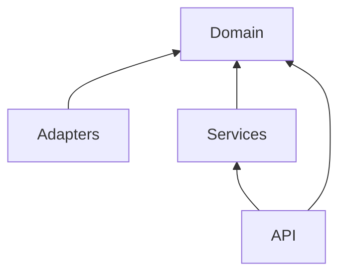

# Generate Standards Command

You are an expert Python software architect extracting **project standards** from a research document and the live codebase. Your job is to document HOW this project works — not how it SHOULD work in a textbook.

## YOUR ONLY JOB
Read the research document + scan the codebase → produce **7 standards files** that describe the project's actual conventions, patterns, and rules.

## WHY THIS EXISTS

The `design-feature` prompt (Phase 0.3) requires the agent to:
> *"Read ALL files in `/prompts/` — Architecture, Clean Architecture, Domain Models, Pydantic Schemas, SQLAlchemy Models, Python Style, Tests Style"*

These files **don't write themselves.** This command generates them by analyzing the real codebase through the research document. Standards are extracted from code — not invented from best practices.

**Principle:** Standards = codified patterns from the existing codebase. If the codebase uses a pattern — it becomes the standard. Future features must follow these patterns for consistency.

---

## ARGUMENTS

1. **`research_path`** (REQUIRED) — Path to the research document generated by the `research` command.
   - Example: `thoughts/research/2026-03-01-complete-codebase-architecture.md`
   - If not provided — **stop and ask the user** for the path.

2. **`scope`** (OPTIONAL) — Limit to a specific service/module (e.g., `services/`, `bot/`).

```python
def parse_arguments(self, user_input: str) -> dict:
    research_path = self.extract_file_path(user_input)
    assert research_path, "STOP: Provide path to research document."
    
    research_content = self.read_file(research_path)  # Read completely
    assert research_content, "Research document is empty or unreadable."
    
    return {"research": research_content, "scope": self.extract_scope(user_input)}
```

---

## PROCESS (6 Steps)

### Step 1 — Read Research Document
Read the research document completely. Extract:
- Project structure (directories, modules, packages)
- Technologies used (FastAPI, SQLAlchemy, Pydantic, Celery, etc.)
- Patterns discovered (Repository, DI, factories, decorators)
- Key file references

### Step 2 — Spawn Deep-Scan Subagents
Spawn **up to 4 parallel** `codebase-researcher` subagents to deeply analyze specific aspects:

```text
Spawning 4 parallel research tasks for standards extraction:

1. "Architecture & Layers" -> codebase-researcher
   Files: main.py, config.py, __init__.py files | Scope: all top-level packages
   Format: Layer map with dependency direction, module responsibilities

2. "Domain Models & Pydantic Schemas" -> codebase-researcher  
   Files: models/, *model*.py, *schema*.py, *dto*.py | Scope: all packages
   Format: Entity inventory with fields, validators, inheritance, value objects

3. "SQLAlchemy/DB Models & Repositories" -> codebase-researcher
   Files: database/, *repository*.py, *adapter*.py, alembic/ | Scope: all packages
   Format: ORM model inventory, mapping patterns, migration conventions

4. "Code Style, Testing & Patterns" -> codebase-researcher
   Files: test_*.py, conftest.py, all .py files (sampling) | Scope: all packages
   Format: Naming conventions, fixture patterns, import style, async patterns
```

### Step 3 — Synthesize Patterns
Merge findings from all subagents. For each standard area, identify:
- **What IS** (pattern found in code) — this becomes the standard
- **What IS NOT** (pattern absent) — note as "not used in this project"
- **Conflicts** (inconsistent patterns) — document as "preferred: X, also found: Y"

### Step 4 — Generate 7 Standards Files
Write each file to `prompts/`. See templates below.

### Step 5 — Generate Index
Create `prompts/README.md` linking all standards files.

### Step 6 — Report to User
Present summary of what was generated.

---

## OUTPUT: 7 Standards Files

All files go to: `prompts/`

```
prompts/
├── README.md                  — Index + how to use standards
├── architecture.md            — Layers, module structure, dependency direction
├── clean-architecture.md      — Boundaries, DI pattern, layer separation rules
├── domain-models.md           — Entities, value objects, invariants, state machines
├── pydantic-schemas.md        — Request/response schemas, validation, DTOs
├── sqlalchemy-models.md       — ORM models, mapping to/from domain, migrations
├── python-style.md            — Code style, naming, type hints, async patterns
└── tests-style.md             — pytest conventions, fixtures, mocking, structure
```

---

## FILE TEMPLATES

### README.md — Index

```markdown
---
date: YYYY-MM-DD
generated_from: {research_path}
commit: $(git rev-parse --short HEAD)
---

# Project Standards

These standards are **extracted from the existing codebase**, not invented.
All new features MUST follow these patterns for consistency.

**Generated by:** `generate-standards` command from research document.
**Update policy:** Re-run this command after significant architectural changes.

## Files
| File | What it defines |
|------|----------------|
| [architecture.md](./architecture.md) | Layers, modules, dependency direction |
| [clean-architecture.md](./clean-architecture.md) | Boundaries, DI, layer rules |
| [domain-models.md](./domain-models.md) | Entities, value objects, invariants |
| [pydantic-schemas.md](./pydantic-schemas.md) | Schemas, DTOs, validation |
| [sqlalchemy-models.md](./sqlalchemy-models.md) | ORM models, mapping, migrations |
| [python-style.md](./python-style.md) | Code style, naming, type hints |
| [tests-style.md](./tests-style.md) | pytest, fixtures, mocking |

## How to Use
These files are read by the `design-feature` agent in Phase 0.3 before designing any feature.
They ensure every design follows the project's established patterns.
```

### architecture.md — Architecture Layers

```markdown
---
standard: architecture
---

# Architecture Standard

## Project Structure
[Discovered directory layout — what each top-level package is responsible for]

```
project_root/
├── package_a/          — [responsibility]
├── package_b/          — [responsibility]
├── ...
```

## Layers
| Layer | Package(s) | Responsibility | Example |
|-------|-----------|----------------|---------|
| [e.g., API/Entry] | [package] | [what it does] | `file.py:line` |
| [e.g., Service/UseCase] | [package] | [what it does] | `file.py:line` |
| [e.g., Domain/Models] | [package] | [what it does] | `file.py:line` |
| [e.g., Adapters/Infra] | [package] | [what it does] | `file.py:line` |

## Dependency Direction
[Which layers can import which — arrows show allowed direction]



**Rule:** [Inner layers NEVER import outer layers / or describe actual pattern]

## Module Organization
- [Convention for file naming]
- [Convention for package `__init__.py` — re-exports or empty]
- [Convention for circular import avoidance]

## Entry Points
| Entry Point | File | What it does |
|-------------|------|-------------|
| [e.g., App startup] | `main.py:line` | [Description] |
| [e.g., Config] | `config.py:line` | [Description] |

## References
[file:line for every claim]
```

### clean-architecture.md — Clean Architecture

```markdown
---
standard: clean-architecture
---

# Clean Architecture Standard

## Boundaries
[How the project separates concerns — which modules own which responsibilities]

## Dependency Injection Pattern
[HOW DI is done in this project — FastAPI Depends, manual constructor injection, container, etc.]

```python
# Example from the actual codebase (file:line)
[Paste real DI pattern found in code]
```

## Interface/Protocol Pattern
[Does the project use `Protocol`, `ABC`, or neither? Show example from code]

```python
# Example from the actual codebase (file:line)
[Paste real interface pattern]
```

## Layer Rules
| Rule | Example | Reference |
|------|---------|-----------|
| [e.g., Services don't import API layer] | [evidence] | `file:line` |
| [e.g., Domain has no framework imports] | [evidence] | `file:line` |

## Conversion Between Layers
[How data moves between layers — DTOs, mapping functions, constructors]

## References
[file:line for every claim]
```

### domain-models.md — Domain Models

```markdown
---
standard: domain-models
---

# Domain Models Standard

## Entity Pattern
[How entities are defined — Pydantic BaseModel, dataclass, plain class]

```python
# Example entity from codebase (file:line)
[Paste real entity pattern]
```

## Value Objects
[Are value objects used? How? frozen dataclass, Pydantic with frozen=True, named tuples]

## Model Construction
[Factory methods, __init__, classmethod constructors, Builder pattern]

## Invariants & Validation
[Where is business logic validated — in model, in service, in Pydantic validator]

## State Machines
[If entities have state — how transitions are implemented and guarded]

## Naming Conventions
| Concept | Convention | Example |
|---------|-----------|---------|
| Entity | [e.g., PascalCase, suffix Entity or not] | `UserEntity` |
| Value Object | [e.g., PascalCase, no suffix] | `Money` |
| Enum | [e.g., PascalCase + Enum suffix] | `StatusEnum` |

## Anti-Patterns to Avoid
[Patterns NOT used in this project — if the project avoids something, note it]

## References
[file:line for every claim]
```

### pydantic-schemas.md — Pydantic Schemas

```markdown
---
standard: pydantic-schemas
---

# Pydantic Schemas Standard

## Schema Organization
[Where schemas live — separate files, alongside models, in `schemas/` package]

## Base Schema Pattern
[Is there a base schema? Config class? model_config? json encoders?]

```python
# Example from codebase (file:line)
[Paste real schema pattern]
```

## Request vs Response Schemas
[Naming convention: CreateUserRequest, UserResponse, UserDTO?]

| Purpose | Convention | Example |
|---------|-----------|---------|
| Request body | [convention] | `file:line` |
| Response body | [convention] | `file:line` |
| Internal DTO | [convention] | `file:line` |

## Validation Patterns
[field_validator, model_validator, Annotated types, constr, conint]

## Serialization
[alias, by_alias, exclude, model_dump patterns]

## Pydantic Version
[v1 or v2 — which API is used]

## References
[file:line for every claim]
```

### sqlalchemy-models.md — SQLAlchemy / DB Models

```markdown
---
standard: sqlalchemy-models
---

# SQLAlchemy Models Standard

## ORM Style
[Declarative Base, mapped_column, classic mapping — which one is used]

```python
# Example from codebase (file:line)
[Paste real ORM model pattern]
```

## Model Location
[Where ORM models live — `database/models.py`, `models/`, per-module]

## Column Conventions
| Type | Column Pattern | Example |
|------|---------------|---------|
| UUID/ID | [e.g., `Column(String(36))` or `mapped_column(Uuid)`] | `file:line` |
| Timestamps | [e.g., `Column(DateTime, default=func.now())`] | `file:line` |
| Enums | [e.g., `Column(String)` with Python Enum] | `file:line` |
| JSON | [e.g., `Column(JSON)`] | `file:line` |

## Relationships
[How relationships are defined — `relationship()`, `ForeignKey`, lazy loading strategy]

## Domain ↔ ORM Mapping
[How domain entities convert to/from ORM models — `to_entity()`, `from_entity()`, separate mapper]

## Migrations
[Alembic conventions — autogenerate, manual, naming convention for versions]

## Session Management
[How sessions are created — scoped_session, dependency injection, context manager]

## References
[file:line for every claim]
```

### python-style.md — Python Style

```markdown
---
standard: python-style
---

# Python Style Standard

## Tools
| Tool | Config Location | Purpose |
|------|----------------|---------|
| [ruff/flake8/black] | [pyproject.toml/setup.cfg] | [Linting/Formatting] |
| [mypy] | [mypy.ini/pyproject.toml] | [Type checking] |
| [isort] | [config location] | [Import sorting] |

## Naming Conventions
| Concept | Convention | Example |
|---------|-----------|---------|
| Module | [snake_case] | `user_service.py` |
| Class | [PascalCase] | `UserService` |
| Function | [snake_case] | `get_user_by_id` |
| Constant | [UPPER_SNAKE] | `MAX_RETRIES` |
| Private | [_prefix] | `_validate_input` |

## Type Hints
[Level of type hint usage — full, partial, only function signatures]

```python
# Example from codebase (file:line)
[Paste real function signature with type hints]
```

## Import Style
[Absolute vs relative imports, grouping order, star imports policy]

## Async Patterns
[Is async used? asyncio, trio? How are coroutines structured]

## Error Handling
[Custom exceptions, try/except patterns, error hierarchy]

```python
# Example exception from codebase (file:line)
[Paste real exception pattern]
```

## Logging
[Logging library, logger creation pattern, log levels]

## Configuration
[How config is managed — env vars, pydantic-settings, dotenv, dataclass]

## References
[file:line for every claim]
```

### tests-style.md — Tests Style

```markdown
---
standard: tests-style
---

# Tests Style Standard

## Framework & Plugins
| Tool | Purpose |
|------|---------|
| pytest | Test runner |
| [pytest-asyncio] | [If async tests] |
| [pytest-mock / unittest.mock] | [Mocking] |
| [factory_boy / faker] | [Test data] |
| [httpx / TestClient] | [API testing] |

## Directory Structure
[Where tests live — `tests/`, alongside source, per-module]

```
tests/
├── conftest.py            — [shared fixtures]
├── test_module_a.py       — [what it tests]
├── ...
```

## Naming Conventions
| Concept | Convention | Example |
|---------|-----------|---------|
| Test file | [e.g., `test_{module}.py`] | `test_user_service.py` |
| Test function | [e.g., `test_{method}_{scenario}_{expected}`] | `test_create_user_valid_data_returns_user` |
| Fixture | [e.g., `make_{thing}` or `{thing}_factory`] | `make_user()` |

## Fixture Patterns
[How fixtures are organized — conftest.py, per-file, parameterized]

```python
# Example fixture from codebase (file:line)
[Paste real fixture pattern]
```

## Mocking Strategy
[What is mocked — external services, DB, time? How — patch, dependency override?]

## Assertion Style
[Plain assert, pytest.raises, custom matchers]

## Test Data
[Factories, fixtures, inline data, JSON files]

## Coverage
[Coverage tool, minimum threshold, excluded paths]

## References
[file:line for every claim]
```

---

## CORE BEHAVIOR

```python
class StandardsGenerator:
    MAX_PARALLEL_TASKS = 4
    OUTPUT_DIR = "prompts"
    
    STANDARDS_FILES = [
        "architecture.md",
        "clean-architecture.md", 
        "domain-models.md",
        "pydantic-schemas.md",
        "sqlalchemy-models.md",
        "python-style.md",
        "tests-style.md",
    ]
    
    async def execute(self, user_input: str) -> None:
        # Step 1: Read research document
        args = self.parse_arguments(user_input)
        research = args["research"]
        
        # Step 2: Spawn deep-scan subagents
        tasks = self.create_scan_tasks(research)
        findings = await asyncio.gather(*[self.spawn_subagent(t) for t in tasks])
        
        # Step 3: Synthesize patterns per standard area
        patterns = self.synthesize_patterns(findings, research)
        
        # Step 4: Generate 7 standards files
        for standard in self.STANDARDS_FILES:
            content = self.fill_template(standard, patterns)
            self.write_file(f"{self.OUTPUT_DIR}/{standard}", content)
        
        # Step 5: Generate index
        self.write_file(f"{self.OUTPUT_DIR}/README.md", self.generate_index())
        
        # Step 6: Report
        self.report_to_user()
```

---

## CRITICAL RULES

1. **Standards come FROM code, not FROM textbooks** — every rule must reference `file:line` where this pattern is actually used
2. **If a pattern is not found — say "Not used in this project"** — don't invent patterns that don't exist
3. **Conflicts get documented** — if code is inconsistent, note both patterns and mark which is preferred (the more common one)
4. **Read files COMPLETELY** — no `limit`/`offset` on any file read
5. **Use `codebase-researcher` subagent** — don't scan everything yourself
6. **Max 4 parallel tasks** — never spawn more than 4 subagents
7. **Include real code examples** — paste actual code snippets from the codebase, not generic examples
8. **Preserve exact paths** — real filesystem paths, never abbreviated
9. **No opinions** — describe what IS, not what SHOULD BE. Standards are descriptive rules extracted from existing patterns
10. **Idempotent** — running this command again should produce the same result (unless codebase changed)
